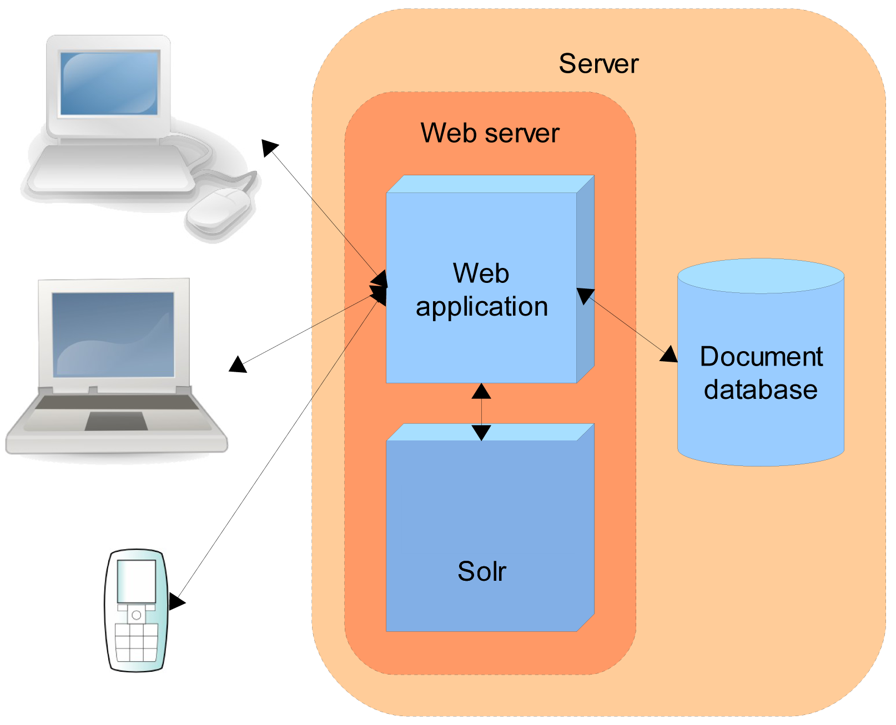

# 总体概览 #
以下是Solr的一种应用场景的整体结构图：

在上面的场景中，Solr和其他应用运行在同一个Web Server中。比如一个在线商店应用会提供用户结果、购物车以及支付功能，商品的条目存储在数据库中。

通过以下步骤Solr可以方便的提供搜索在线商店商品的功能：
1. 定义一个schema，告诉Solr将要索引的文档的结构。比如在线商店会定义产品名称、描述、价格、制造商等字段。Solr的schema非常强大和灵活，足以满足应用需要。See Documents, Fields, and Schema Design for all the details.
2. 将Solr部署到应用服务器中。
3. 将用户要搜索的文档加入到Solr中。
4. 在你的应用中完成查询功能。

Solr是基于公开标准的，很容易扩展，Solr的查询是RESTful的，查询是是一个简单的HTTP请求URL，结果是一个结构化的文档，格式可以是XML、JSON、CSV和其他格式。这使得应用可以通过多种方式使用Solr，如浏览器客户端、富客户端应用、移动设备及其他任何支持HTTP的方式。更多关于客户端API参见[Client APIs]()

Solr是基于Apache Lucene的高性能、功能完备的搜索引擎。Solr既支持最简单的关键词查询到多字段的复杂查询以及facet查询等。更多关于检索和查询参见[Searching]()

Solr处理大规模数据的能力令人印象深刻，常见的场景是，面对大量的查询请求一台服务器无法快速响应时，你可以创建多份索引拷贝，这被称为replication.这样就可以通过一定的算法规则将新进的查询分配到多份索引拷贝上，最简单的算法就是roud-robin。

另外一种技术是sharding，如果你索引的文档数量太大，可能由于内存或者索引大小的问题无法全部放在一个节点中，你可以将一个索引分割成多份，成为shards.每个shard在自己的物理机上，一个查询会被发送到所有的shard机器上，然后合并返回搜索结果。

如果你有大量的文档和用户，你可能需要将sharding和replication两种技术结合起来使用。针对这种情况，Solr的新功能SolrCloud可以更高效的满足你的需求。SolrCloud提供了一系列功能简化了分布式索引和查询的处理。

关于sharding和replication的更多细节参见[Legacy Scaling and Distribution]().SolrCloud在单独的章节介绍：[SolrCloud]().

Solr能够支撑大规模数据的应用并非猜测，很多有名的网站目前都在使用Solr，如Macy's、Ebay、Zappo's.

