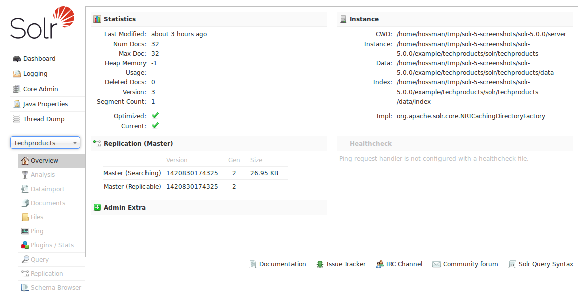

# Core管理工具 #
在左侧的导航菜单中，有一个提示信息是“Core Selector”的下拉菜单，点击菜单会列出所有的Solr cores，并且可以通过搜索框快速找到指定的core（当你的core很多时会很有用）。

当选中一个core，如collection1，会展示一个可以管理这个core的二级菜单。

当选择一个core之后，页面中间会显示这个core的统计信息。你可以定义一个admin-extra.html的页面来包含其他的链接信息来展示到“Admin Extra”区域中。

在左侧core名字的下面的二级菜单是针对当前选中core的功能选项列表。以下是core相关的功能选项：

- [Analysis](1.4.8.1-analysis-screen.md)-分析指定字段的数据
- [Dataimport](1.4.8.2-dataimport-screen.md)-展示Data Import Handler的当前状态信息
- [Documents](1.4.8.3-documents-screen.md)-你可以通过浏览器中的一个简单的表单来执行各种Solr建索引的命令
- [Files](1.4.8.4-files-screen.md)-显示当前core的配置文件信息如solrconfig.xml和schema.xml
- [Ping](1.4.8.5-ping.md)-通过ping一个core来检查它是否可用
- [Plugins/Stats](1.4.8.6-plugins-and-stats-screen.md)-显示插件和其他已安装模块的统计信息
- [Query](1.4.8.7-query-screen.md)-你可以向一个core提交可以包含多种参数的结构化的查询
- [Replication](1.4.8.8-replication-screen.md)-显示当前replication的状态，也可以启用/禁用replication
- [Schema Browser](1.4.8.9-schema-browser-screen.md)-在浏览器中展示schema数据

