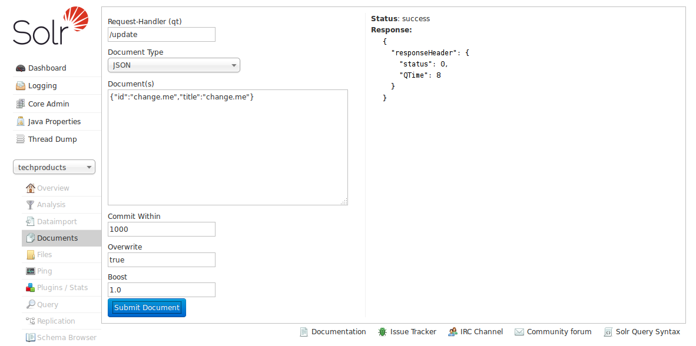

# Documents界面 #
Documents界面提供了简单的浏览器表单，可以以多种数据格式来执行各种Solr建索引的命令。

主要支持以下功能：

- 支持将JSON、CSV和XML格式的文档提交到索引
- 上传文档（支持JSON、CSV、XML格式）
- 通过选择字段和字段类型来组建文档

要启动Documents界面功能，需要定义RequestHandler，默认是/update路径，。。。

选择要加载的文档类型，下面的参数会根据选择文档类型改变。

### JSON ###
当使用JSON类型时，和在命令行使用requestHandler功能一样，你可以在文本框里输入文档内容，而不用通过curl来提交文档了，文档的格式仍要要求是规范的JSON格式。

然后你可以选择什么时间将文档加入到索引中（Commit Within），当文档的id相同时是否覆盖以后的文档（如果设置不是true，则新加入的）
