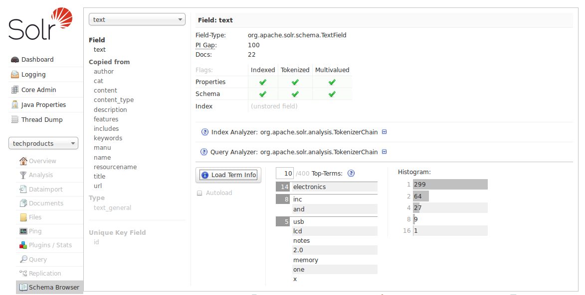

# Schema浏览界面 #
Schema浏览界面可以在浏览器中查看schema的配置信息，如果是从Analysis界面链接过来的，会展示指定的字段、动态字段规则或者字段类型。也可以通过下拉菜单来选择字段或字段类型。

该界面提供了每个字段的更多详细信息。在上图的示例中，我们选择的text字段，右边我们可以看到字段名字，copy到text字段的字段列表。选中这些字段，可以查看该字段的详细定义。可以查看该字段建索引和查询使用的分析器，点击展开可以看到定义的分词器和过滤器。

下面的“Load Term Info”按钮，可以展示索引中这个字段的前N个term值。如果每个字段都想查看term信息，可以选择“Autoload”，这样选择每个字段时都会展示该字段的term信息。histogram展示了该term在这个字段中出现的频率值。
