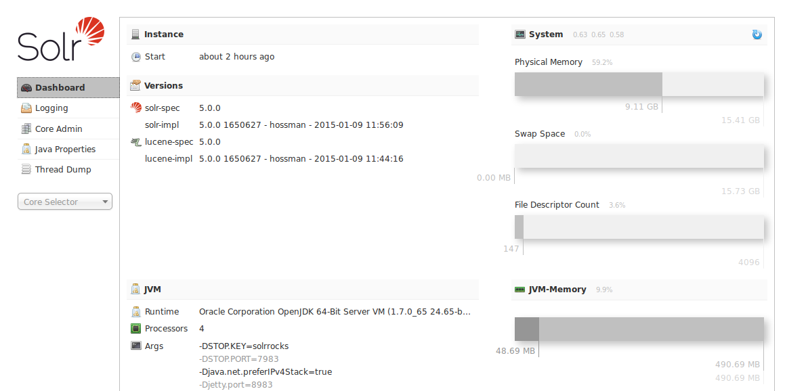

# Solr Admin UI概述 #
Solr提供了一个Web管理界面，方便Solr管理者和开发者查看Solr配置信息、执行查询或者分析文档字段、进行性能调优、访问一些在线文档或者获得其他帮助信息。

在Solr4中，Solr Admin进行了完全重新设计：

- 加载页面更快速
- 从控制面板访问和选择功能
- 重用了通过外部接口访问Solr相关数据的servlets
- 统一了单个core和多个core的视图

访问URL http://hostname:8983/solr/(如果启动Jetty使用的默认8983端口)，会看到分成左右两部分的控制台界面。

左侧菜单提供了访问各功能界面的导航，上面一组链接是查看系统信息和配置的，查看Logging、Core Amin和Java参数等。下面提供了一个Solr core实例的选择菜单，选择一个core之后会展示针对core的二级功能菜单。功能列表包括Schema、Config、Plugins以及执行查询等功能。

中间内容展示类选中的功能选项的详细信息，内容可能是参数、文本或者图示化的信息。下面会详细介绍每个界面：

### 在solrconfig.xml中设置Admin UI ###
你可以在solrconfig.xml中设置Solr Admin UI.

solrconfig.xml中的<admin>标签定义了在core的查询界面中的默认查询，默认是\*:\*，来查询所有文档，在示例中，我们改成solr.

	<admin>
	    <defaultQuery>solr</defaultQuery>
	</admin>

**相关话题** [配置solrconfig.xml]()

