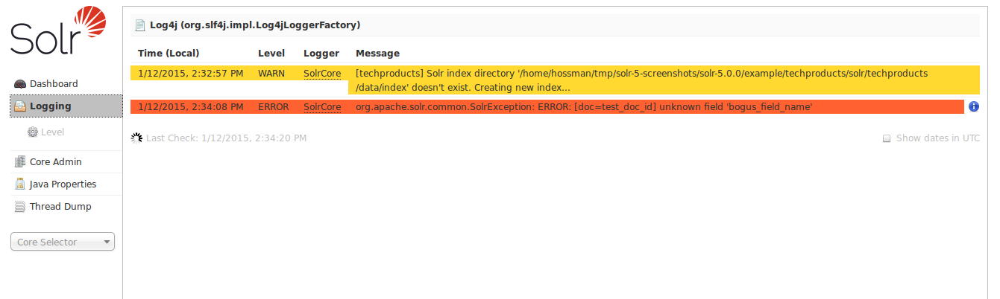
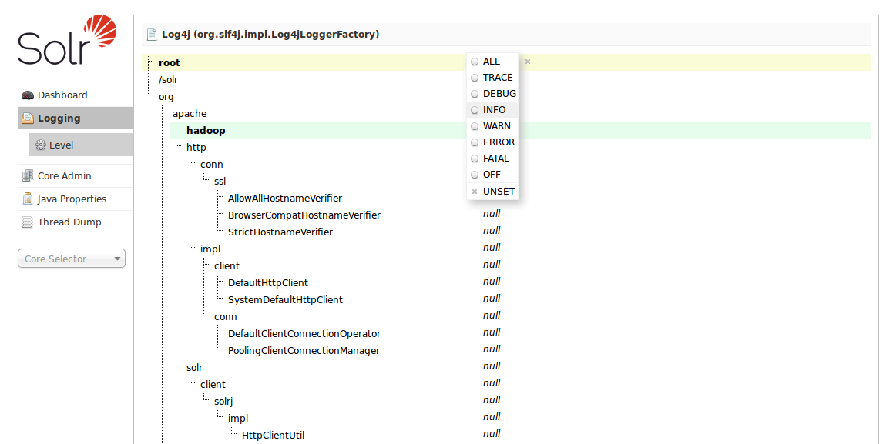

# Logging #
Logging页面显示来自Solr日志文件的消息。点击“Logging”将会展示类似下面的界面：

*Logging主界面*

示例中只显示了一个core的日志信息，如果一个实例中有多个core，每个都会列出来。

**选择Logging Level**

点击左侧的Level链接之后，你可以看到以树形结构展示的Solr实例中的class路径和类名。有的行背景是黄色高亮的，说明这个类有logging功能，点击高亮的行，会弹出一个可以修改这个类日志级别的菜单。加粗字体的类是不能修改日志级别的，如root.

关于更多日志级别的介绍参见[Configuring Logging]().

