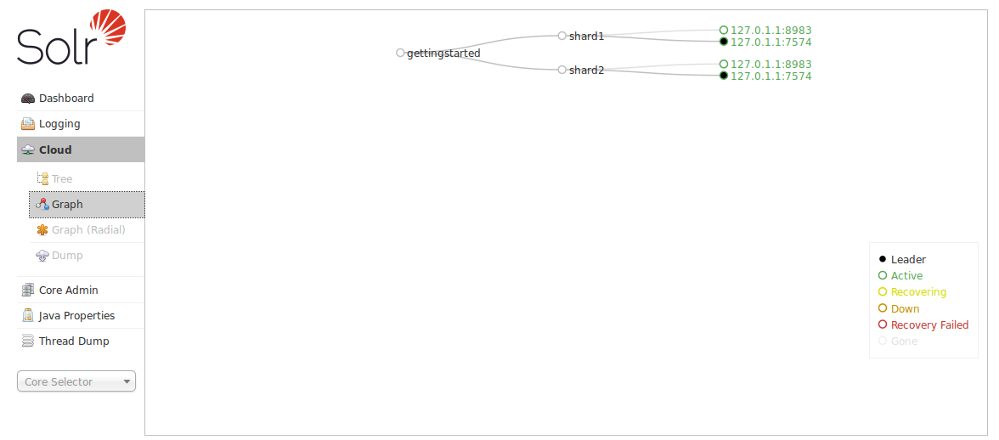
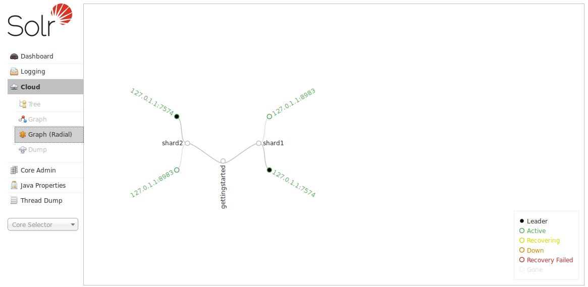
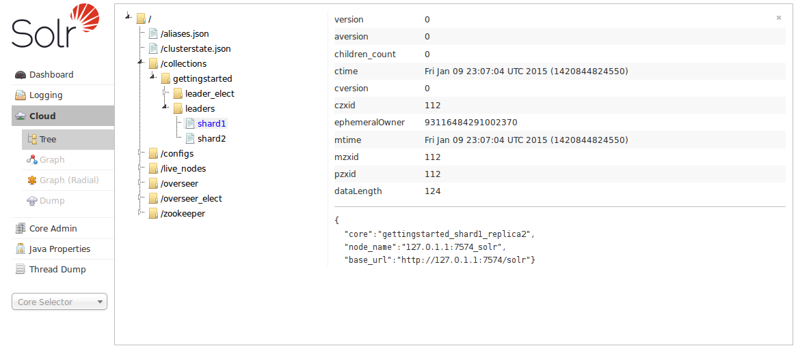

# Cloud界面 #
当以SolrCloud模式运行Solr，就会在Admin UI中的Logging和Core Admin之间出现Cloud的链接选项。目前还不支持对SolrCloud机器的node管理，不过你可以到每个每个node上的Admin UI中进行管理。

点击左侧菜单中的Cloud选项，会出现一个子菜单，包括Tree、Graph、Graph(Radial)和Dump。默认的Graph界面会展示每个core和每个node的地址，下面的图中展示了有两个node一个core的集群：

Graph(Radial)菜单提供了另外一种查看node的视图，同样的一个core两个node集群看起来是这样的：

Tree选项会展示存储在ZooKeeper中文件的目录结构，包括clusterstate.json、配置文件以及其他状态信息文件。在这个例子中，我们列出了名字是collection1的core的leader定义文件：

最后一个选项是Dump，可以下载存储在ZooKeeper中的XML配置文件。

