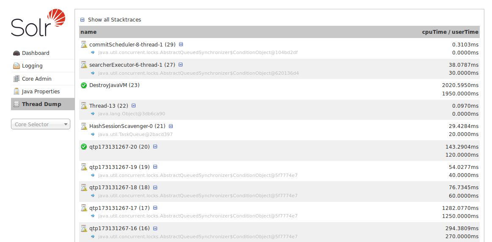
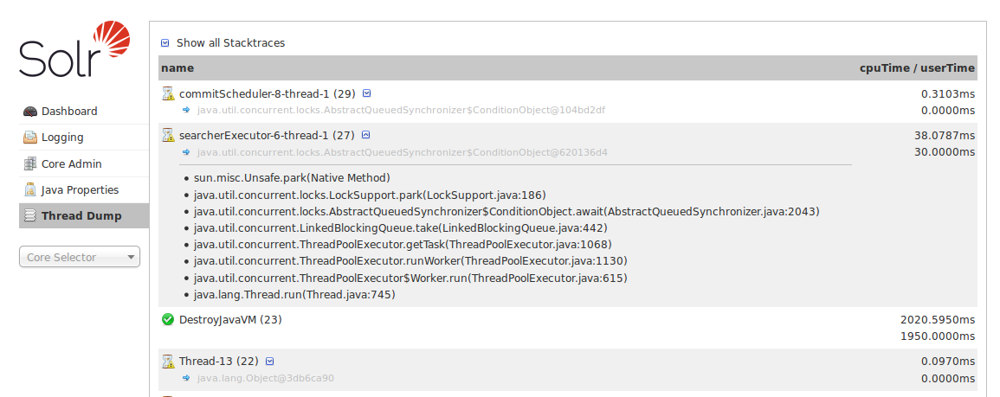

# Thread Dump #
Thread Dump界面可以查看当前server中活动的线程，每个线程都会列出来，并可以查看堆栈信息，左侧的图标显示了当前的thread状态，比如绿色对勾的线程代表“RUNNABLE”状态，在线程名右边向下的按钮，表示你可以展开看该线程的堆栈信息。

当你把鼠标箭头移动一个线程名上，会有浮动窗口显示线程的状态，线程的状态有以下几种：
<table>
<th>
<td>状态</td><td>含义</td>
</th>
<tr>
<td>NEW</td><td>一个还没启动的线程</td>
</tr>
<tr>
<td>RUNNABLE</td><td>JVM中执行中的线程</td>
</tr>
<tr>
<td>BLOCKED</td><td>线程被阻塞，等待monitor lock</td>
</tr>
<tr>
<td>WAITING</td><td>一个线程正在等待另一个线程的操作</td>
</tr>
<tr>
<td>TIMED_WAITING</td><td>一个线程正在等待另一个线程的操作，只在限制的时间内等待</td>
</tr>
<tr>
<td>TERMINATED</td><td>一个已经结束的线程</td>
</tr>
</table>

当你点击可以被展开的线程时，你可以看到堆栈信息，如下图所示：

*查看单个线程*

你可以选中“Show all Stacktraces”按钮来自动查看所有的线程。
