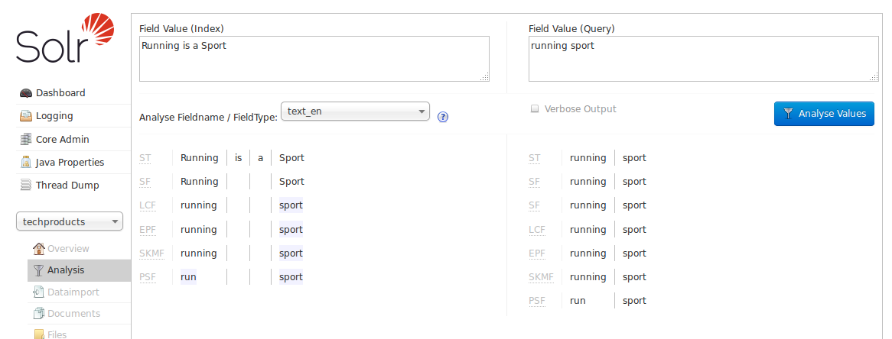
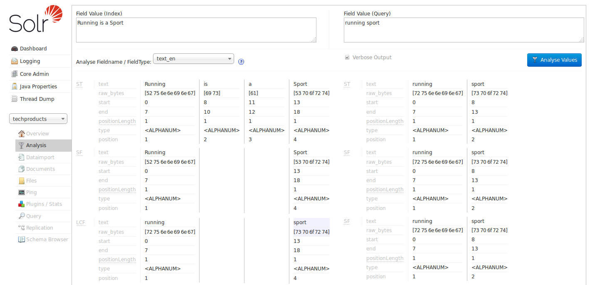

# Analysis界面 #
Analysis分析界面可以分析定义在schema.xml中的不同字段、字段类型以及动态字段规则下数据是如何被处理的。你可以分析在建索引和查询阶段是怎样被处理的，可以分开或一起来看。在这个界面中你可以检查字段类型或者分词器的配置是否正确，让配置更可靠。

在顶部的两个文本框或其中一个里输入文本内容，然后选择要分析的字段或字段定义。没有选中“Verbose Output”选项的情况下，页面会显示输入的文本内容在当前的配置下，每一步分析步骤的标准结果信息。

如果勾选了“Verbose Ouput”，你会看到更多的详细信息，包括输入内容的转换（如转换为小写、去除特殊字符等）、字节数、类型以及位置信息等。根据选择的字段或字段类型不同，数据结果会略有差异。每一步处理都会在单独的区域显示，带有当前步骤处理的分词器或过滤器的缩写。悬停或点击缩写名，可以查看分词器或过滤器的完整名称和路径信息。

在上图中，字符串“Running is a sport”经过了几次转换处理。我们使用了“text”类型，它会移除“is”和"a"，“running”被转换为它的基本类型“run”。这个因为我们定义了字段类型“text_en”，它会移除停用词（在内容中没有具体含的助词），然后会提取主干词（对于处理复数词会很有用）可以匹配到更多查询结果。如果点击“Analyze Fieldname/Field Type”后面的问号图标，schema浏览窗口会打开，显示指定字段的配置信息。

[Understanding Analyzers, Tokenizers, and Filters]()会详细介绍每一个参数设置会对数据做怎样的处理，[Runing Your Analyzer]()会有介绍使用Analysis界面的具体示例。

