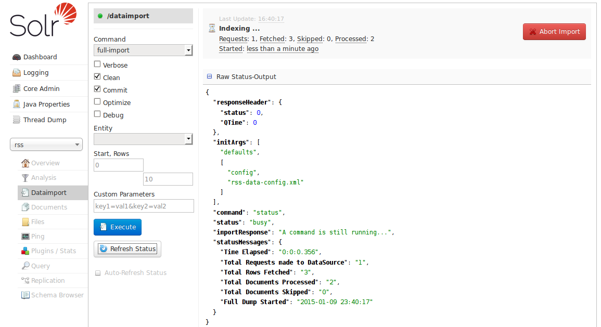

# Dataimport界面 #
Dataimport界面会显示DataImportHandler(DIH)的配置信息，可以根据界面中选中的配置项和配置文件中定义的配置来开始创建索引。

配置文件定义了数据的来源以及执行的SQL语句，界面中定义的参数控制数据怎样被导入到Solr中。更多关于DIH数据导入的信息，参见[Uploading Structed Data Store Data with the Data Import Handler]().
