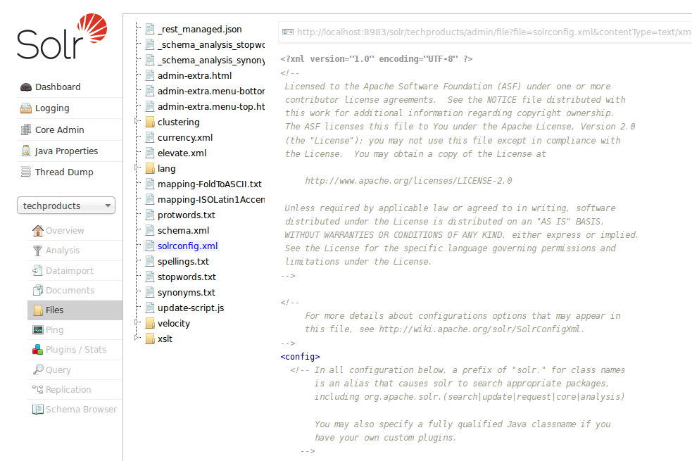

# File Screen #
File Screen可以查看你选择的core的各种配置文件（如solrconfig.xml和schema.xml）.

solrconfig.xml定义了Solr索引文档内容和响应请求的相关参数设置，schema.xml可以定义数据内容的字段类型，你的文档是由哪些字段组成，是否根据提交的文档的字段名称或字段类型来生成动态字段。其他的配置文件也可以被查看，取决于它们是怎样在solrconfig.xml和schema.xml中定义的。

配置文件是不能在界面上进行编辑的，你只能在文档编辑器中进行修改。

这个界面可以链接到[Schema Browser Screen]()，该界面既可以展示schema的信息，也可以下钻到分析链、显示字段类型、字段以及动态字段的规则。

solrconfig.xml和schema.xml中的参数都会在接下来的内容中介绍，你可能需要回顾下以下内容：

- [Indexing and Basic Data Operations]()
- [Searching]()
- [The Well-Configured Solr Instance]()
- [Documents, Fields, and Schema Design]()

