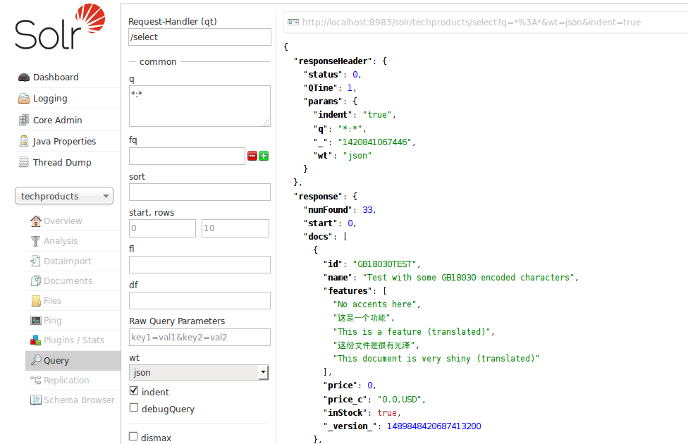

# 查询界面 #
Core二级菜单中的Query界面，可以向Solr提交一个query查询并查看结果。下图的示例中展示了查询*:*返回的JSON格式的结果。

该查询提交到了名叫“collection1”的core，使用的默认查询语句*:*（在solrconfig.xml中定义了默认查询条件），该查询会返回这个core的中索引中的所有文档。后面会详细介绍查询的其他可选参数。

返回的查询结果显示在表单的右侧，查询是一个简单的HTTP请求，在查询结果内容的上面显示了请求的URL链接；如果点击则会单独打开一个只包含请求和返回结果的界面。因为在请求参数中有wt=json，所以查询的结果是JSON格式的。

查询的结果一般包含两部分responseHead和response，当使用了其他查询参数时返回结果会包含更多部分。其中responseHeader包含查询的状态信息(status)、处理查询的耗时(QTime)和查询参数(params)。

reponse包括doc标签中的查询结果文档集，查询匹配到的文档数。返回的文档的字段是由查询参数和request handler的默认设置决定的。

该界面只提供了常用的查询参数，更多的参数选项可以在浏览器中手工拼URL来设置，以下是可用的参数：

<table>
<tr><th>参数</th><th>描述</th></tr>
<tr>
	<td>Request-handler(qt)</td>
	<td>指定request handler，Solr默认使用standard query handler处理请求</td>
</tr>
<tr>
	<td>q</td>
	<td>查询，该参数的更多详细解释查看[Searching]()</td>
</tr>
<tr>
	<td>fq</td>
	<td>过滤查询，该参数的更多详细解释查看[Common Query Parameters]()</td>
</tr>
<tr>
	<td>sort</td>
	<td>将查询结果按照评分或者指定的字段按升序或降序排序</td>
</tr>
<tr>
	<td>start,rows</td>
	<td>start和rows共同实现了翻页，start是返回所有查询结果的偏移量，默认是0，从查询结果的第一个文档返回。rows指定返回的文档的数量，</td>
</tr>
<tr>
	<td>fl</td>
	<td>定义每个文档返回的字段列表，可以用逗号或空格分隔列出所有希望返回的且已存储的字段。在Solr4中，函数返回的结果也可以在fl中指定</td>
</tr>
<tr>
	<td>wt</td>
	<td>指定查询结果的文档格式，默认是XML。定义了格式化查询结果的Response Writer。</td>
</tr>
<tr>
	<td>indent</td>
	<td>查询结果是否缩进，是否更加可读</td>
</tr>
<tr>
	<td>debugQuery</td>
	<td>使用该参数，查询结果会返回debug信息，每个文档都会包含“explaininfo”，给管理员和开发者提供帮助。</td>
</tr>
<tr>
	<td>dismax</td>
	<td>是否使用Dismax query parser，更多信息参见[The DisMax Query Parser]()</td>
</tr>
<tr>
	<td>edismax</td>
	<td>是否使用Extended query parser，更多信息参见[The Extended DisMax Query Parser]()</td>
</tr>
<tr>
	<td>hl</td>
	<td>是否启用高亮，更多信息参见[Highlighting]()</td>
</tr>
<tr>
	<td>facet</td>
	<td>faceting，可以将查询结果按索引的字段进行分类，更多信息参见[Faceting]()</td>
</tr>
<tr>
	<td>spatial</td>
	<td>地理位置数据的查询，更多信息参见[Sptial Search]()</td>
</tr>
<tr>
	<td>spellcheck</td>
	<td>语法检查器，更多信息参见[Spell Checking]()</td>
</tr>
</table>
#### 相关内容 ####

- [Searching]()

