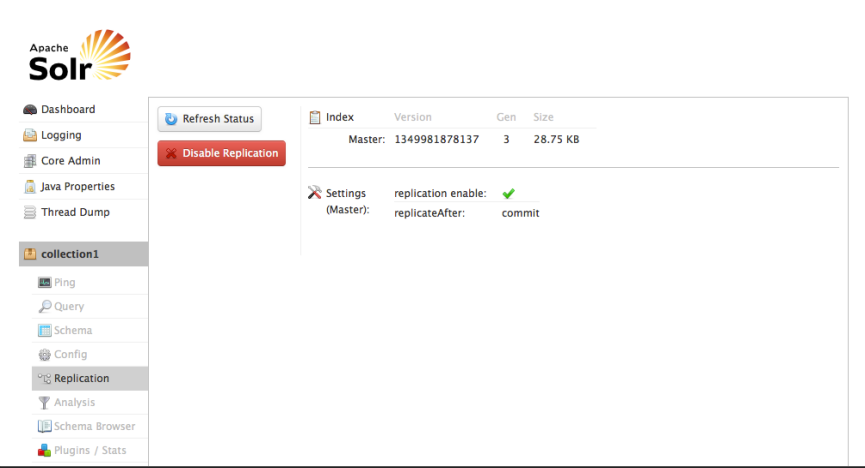
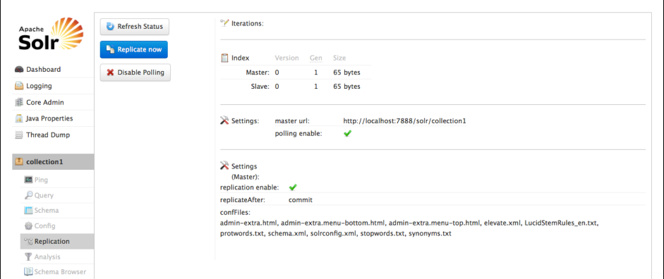

# Replication界面 #
该界面展示当前选择的core的索引复制状态，在Solr中repliaction只是对索引文件的复制。SolrCloud提供了更高级的替代功能。

上图的例子中，replication被启用了，在每次commit之后进行复制。因为该服务器是Master，因此仅展示了master的配置信息，在master你可以通过点击“Disable Replcation”按钮来禁用replication功能。

在Solr中，replication是由slave server发起的，因此slave节点上可以看到更多信息，如下图所示：

可以点击“Refresh Status”按钮来显示当前的replication状态，点击“Relication now”来从master同步一个最新的索引快照。

更多关于如何配置relication的信息参见[Index Replicaion]().

